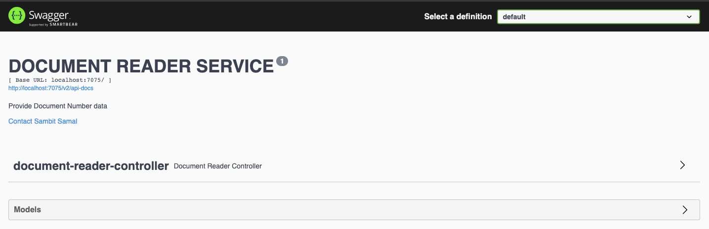

# Document Reader Service

## Description:

This service is responsible to extract all numbers from the content in an input document. And also provide a ‘reference’
to the original document for each number in the result.

## Input Data :

Upload the document you want to fetch data from. As of now service will only support .txt format documents. If you
upload and execute any other file format it will give you unsupported file format error. **_Max File size : 5MB_**

### example

- testDoc.txt file with
  content: `One sentence with no more than 10 words and a number 5. Another sentence, on line 2 of this document, with nine words. In total, we have 3 results in numeric format, and five results in string format.`
- Output : It will fetch the numeric values (10,5,2,3) and show the line number it's present and index position of that
  number. eg:
    - 10, 5 : -> line number:1, indexes: 31,53
- As of now it will not consider the numeric value present in string format. eg: nine,five etc.

## Pre-requisite

- Java 11
- Maven
- Git bash (Or any IDE from where you can connect to git)

## Steps to run the application

- Checkout the code / Download from git repo(https://github.com/sambit1007599/document-reader-service.git)
- checkout : open git bash and run command `git clone https://github.com/sambit1007599/document-reader-service.git`
- open command prompt(cmd)
- go inside the project folder
- run command `mvn clean install`
- once its successfully build run command `mvn spring-boot: run`

Now application is up and running

## How to use this service

- Open the URL in your browser : http://localhost:7075/swagger-ui/index.html
- You will see a swagger page with all the defined specs of the service. There will be 1 POST method you can see.
- 

### 1. POST : /v1/document

#### Description:

- This endpoint is to extract all numbers from the content in an input document.
- Click on POST -> Try it out -> upload the file you want -> Execute
- Click on POST -> Try it out -> upload the file other than txt format -> Execute -> you will see customized error
  message.

## Improvements:

- Implement Separate parser method to support numeric values present in string format.
